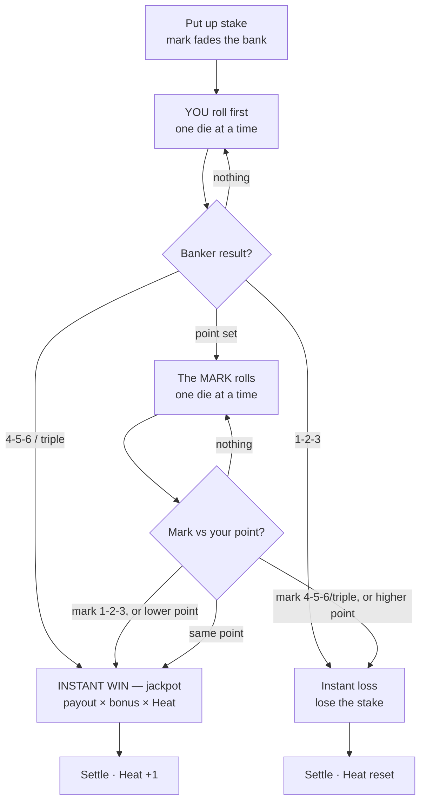

# BONES — Game Design Spec

> *Title: **BONES** — old gambling slang for dice (originally carved from bone); doubles as the noir threat of ending up in the river. In-fiction, the debt Vito holds over you is still called your **"marker"** (a gambling IOU). Alts considered: "The Marker", "Vig", "Snake Eyes".*

A single-player, **luck-forward dice roguelike** with a 1940s noir skin. You owe a mobster a debt you can't pay. He gives you a marker and one way out: win it back rolling dice in the back alleys. Each night the collector comes for more than the last. You build a cup of crooked and charmed dice, ride hot streaks, and gamble on not getting caught — until you buy your freedom or end up in the river.

This is the authoritative design spec. It builds on [`RESEARCH.md`](./RESEARCH.md) (the grounding study of Cloverpit, Balatro, Scritchy Scratchy).

---

## 0. Locked decisions

| Decision | Choice |
|---|---|
| **Genre** | Single-player luck-forward dice roguelike |
| **Theme** | 1940s noir; back-alley street gambling; debt to a mobster |
| **Setting / staging** | **Always on the street.** Dice are rolled on the **ground** — bounced off a wall or curb — with players in a crouched circle and money on the pavement. **No tables, no felt, ever.** |
| **Art direction** | Hand-drawn graphic-novel noir (inked, high-contrast, spot color) |
| **Platform** | **Web-based, mobile-first**, responsive up to desktop/PC |
| **Run length** | Short & punchy early (~20–40 min); scales to 1 hr+ as the player goes deeper (Cloverpit-style escalation) |
| **Skill vs luck** | **High luck — "feels wild."** Control over individual rolls is rare and precious; agency lives in *preparation and risk management*, not roll-manipulation |
| **Night structure** | **3 games per night** (each game = one Cee-lo round). Fail to meet the night's debt → **you get whacked (game over)** |
| **The game** | **Cee-lo only** (single game), player as the **permanent banker** — you put up the stake, roll first, win ties. Instant win (jackpot) or the mark counter-rolls. No other games |
| **Lose conditions** | **(1) Broke** — can't make a stake; **(2) Whacked** — miss a night's debt. No safety net. Either → game over, start again (roguelike) |
| **Difficulty engines** | Two, escalating together: the **rising debt** (§6.3) and **The Squeeze** (§6.4) — base win-odds **crater to ~15% by Vito** (opponents cheat back), so **you must cheat to win**; your dice/charms claw the odds back |
| **Win condition** | **Finite & narrative.** The final night ("The Reckoning") is a **high-stakes Cee-lo game, 1:1 vs Vito**, for the IOU — **beat it and you win** (not a high score). Post-win content is reserved as DLC |
| **Items / unlocks** | A mix of **limited-use items** (consumable, typically *more powerful*) and **persistent items** (permanent, steadier) |
| **Upgrades** | Every upgrade is a **% chance to proc**, with **levels** that raise the % (and the cost/risk) |
| **Tension system** | **Suspicion = chance to get busted**, deliberately **rare (~1 in 30–40 games)**, rising with more/stronger cheat dice; felt as creeping dread, never a meter |
| **Onboarding** | **No tutorial, no upfront rules, no pop-ups.** Players learn by playing — mechanics reveal themselves through the loop. Complexity is gated early (see §8.2) so the first experience is just the core loop |
| **Monetization** | **None in the gameplay loop.** No real-money wagering, no microtransactions, no loot boxes  |

---

## 1. Design pillars

1. **The dice are the star.** The pick-up → shake → *one-die-at-a-time* reveal → score is the heartbeat. Everything serves that moment's anticipation and payoff.
2. **Wild luck, earned tension.** Outcomes swing hard. The player rarely controls a roll — instead they control *the gamble*: which dice to load, when to cheat, when to push a streak, when to walk. Drama comes from the swing, not from grinding odds to certainty.
3. **The walls close in.** A rising debt with hard collection deadlines turns gambling into survival. The pressure is the point.
4. **You have to cheat.** Honest odds fall to ~15% by the end — winning means loading dice. Getting caught is a *rare, scaling* risk (~1 in 30–40 games), so cheating feels clever and powerful, not doomed. The game is about *building* the right crooked cup.
5. **One more run is built, not bought.** Replay comes from variety of dice/builds and deeper escalation — never from spending money.

---

## 2. Theme & setting

**Place & era.** A rain-slick city, 1947. Neon bleeding into puddles, cigarette smoke, jazz two blocks over. You're a small-time hustler who borrowed from the wrong man — **Vito Carbone**, who runs the docks. You play dice in alleys, on tenement stoops, and under the El tracks — always crouched over bare concrete, the bones bouncing off a brick wall — to make his marker.

**Staging (core identity).** Every game happens **on the street, on the ground**. A circle of players hunched over the pavement; dice thrown against a **wall or curb as the backstop** (a real street-craps rule — no bounce, no throw); cash held in fists or weighted under a rock. There are **no tables, no felt, no chairs** — just concrete, chalk lines, gutter water, and bad intentions. This shapes the camera (looking *down* at the ground), the art, and the feel.

**Fantasy.** The desperate-but-cocky underdog working an angle. Loaded dice up the sleeve, a lookout on the corner, a hot streak that makes you feel untouchable — and the cold drop when the banker grabs your wrist.

**Tone.** Noir: fatalistic, stylish, wry. Money is survival, luck is fate, and everyone's running a con.

**Cast (recurring NPCs, gives the world a face — per RESEARCH: a *named* opponent beats a faceless crowd).**
- **Vito Carbone** — your creditor and the final-boss opponent.
- **The Collector** — Vito's enforcer who arrives each night for the payment (the deadline made flesh).
- **Marks** — a rotating cast of Cee-lo opponents who fade your bank, night to night (the nervous rookie, the carnival barker, the old gambler, the dock boss, etc.).
- **Fences & fixers** — sell you dice, charms, and favors between nights.

---

## 3. Art direction — graphic-novel noir

The look the prototype missed. Target reference: **inked noir graphic novel** (Sin City's contrast, Mike Mignola's shadow shapes, a 1940s crime-comic palette).

- **Linework:** bold, confident black ink. Heavy blacks, rough hatching/halftone for shadow and shading. Things read as *drawn*, not rendered.
- **Palette:** near-monochrome — ink black, paper cream/bone white — with **one or two spot colors carrying meaning**: **amber/gold = money & heat**, **red = danger, suspicion, blood**. Spot color is rare, so it *pops*.
- **Characters:** illustrated portrait busts with strong silhouettes and expressions; framed like comic panels. They react to wins, losses, and your cheating.
- **Dice:** inked, weighty objects with hand-drawn pips. Crooked dice carry a subtle visual *tell* (a glint, a heavier shadow) the player learns to read.
- **Juice via comic language (this is the key insight):** feedback is delivered as **hand-lettered onomatopoeia** — `CLACK`, `SNAKE EYES!`, `BUST!`, `HEADCRACK!` — bursting in as comic SFX. Panels jolt and ink-splatter on big hits; the whole frame can fracture into panels on a win streak. This *is* the juice, and it's native to the style.
- **Motion:** limited, deliberate animation — paper-cutout / puppet-rig style movement, panel-to-panel cuts, ink bleeds and smoke. Cheaper to produce than full animation and *more* on-style.
- **Typography:** condensed noir display faces for headers (poster/marquee feel); a clean readable face for numbers and rules.
- **Sound (direction):** smoky upright jazz, vinyl crackle, rain. Diegetic dice clack and coin clink. Music swells with Heat; a needle-scratch/bass-drop stinger on a Bust.

---

## 4. Platform & technical direction

- **Web-based, mobile-first, responsive.** Plays in a mobile browser one-handed; the same layout scales up cleanly to tablet and desktop.
- **Orientation:** **portrait-primary** (one-handed thumb play). Landscape supported on larger screens.
- **Input:** touch-first — **flick the cup up to throw** (click-drag up on desktop), tap to open the Bag / Fence, drag dice to set your loadout (see §12). No "roll" button. Optional device-motion shake on mobile as a flavor alternative (never required).
- **Performance:** must run smoothly on mid-range phones. The inked/halftone style and panel-cut animation are deliberately lightweight (favor 2D sprites/SVG + shaders for grain over heavy 3D).
- **Persistence:** local save for run + meta progression; account/cloud optional later.
- **Offline:** fully playable offline (no server dependency in the core loop).
- *Engine choice is deferred* — this spec is engine-agnostic. (Candidates to evaluate when we build: a 2D web engine like Phaser/PixiJS, or a cross-platform engine with web export like Godot. Decide after the spec is approved.)

---

## 5. The core loop

The irreducible heartbeat, identical across every dice game:

1. **Pick up the dice** — choose which dice from your cup go into your hand for this throw. (This is where loadout/upgrades matter; in high-luck design, *this* is a primary lever of agency.)
2. **Shake** — builds anticipation. Shake intensity/sound reflects Heat and how crooked the cup is. (Tap-and-hold, or optional motion-shake on mobile.)
3. **Roll out onto the ground — one die at a time** — the dice spill from the hand/cup, bounce off the **wall/curb**, and skitter across the **pavement**. Sequential reveal. **The single most important juice moment.** Each die lands as its own beat with a `CLACK` on concrete; the **final die lingers** for maximum tension before it settles. Crooked dice may visibly *cheat* mid-reveal (and tick Suspicion).
4. **Score** — resolve against the current game's rules → win, lose, or push. Payout scales by Heat and any procs. Big results detonate the comic-SFX juice.

**Loop nesting (three arcs):**
- **Round arc (one game):** the banker roll reveal → an instant win, or the mark's counter-roll — plus the Suspicion gamble.
- **Night arc (3 games):** Heat compounding across consecutive wins; Suspicion rising as you cheat.
- **Run arc (the campaign):** the rising debt and collection deadlines across nights — the walls closing in.

---

## 5.1 The Cee-lo round — the MVP core game (you are the banker)

Bones starts with **one game: Cee-lo**, with a defining twist: **you are always the banker.** The banker rolls first and can win outright (the jackpot); only if you set a "point" does the opponent roll. That two-path structure — *win straight away, or a tense back-and-forth* — is exactly the loop we want. Full rules: [`ceelo.md`](./ceelo.md).

**The banker seat = your structural edge — *early*.** It's the best seat in Cee-lo: you act first, and in Bones **ties go to the banker** (house rule). You're a slight favorite *to begin with* — the player-favored, jackpot-capable opening feel. But that edge **erodes as the run goes on** (see §6.4, The Squeeze): the tie rule and the opponent's sharpness drift against you, until by the time you face Vito the odds have inverted and only your build keeps you alive.

**A "game" = one Cee-lo round.** Each night you get **3 games (3 rounds)**. Per round:

1. **Put up your stake.** You wager money from your bankroll — *the bank*. An NPC **mark** fades (covers) it. The stake is both what's at risk **and** what you stand to win (even money, before bonuses). This is "the money you put up to win with."
2. **Pick up → shake → roll first (you, the banker)** — the one-die-at-a-time reveal:
   - **4-5-6 or a triple → INSTANT WIN (jackpot).** The mark never rolls. Pays a **bonus** (triple > 4-5-6 > point win). Maximum juice.
   - **1-2-3 → instant loss.** You pay out — lose the stake.
   - **A point (pair + odd die) → the bank's point.** Now there's a game on: the mark rolls to beat it.
   - **Nothing → re-roll** (another anticipation beat).
3. **The mark rolls — only if you set a point** — trying to beat you:
   - mark 4-5-6 / triple → you lose · mark 1-2-3 → you win · **higher** point → you lose · **lower** point → you win · **same point → tie goes to you (the banker).**
4. **Settle.** Win → `bankroll += stake × payout × Heat`. Lose → `bankroll −= stake`.

**Payouts (tuning placeholders):** point win **1:1** · 4-5-6 **2:1** · triple **3:1** (6-6-6 the top). All multiplied by **Heat** (the win-streak across the night's 3 games).

> **A game is one round.** **Heat** and **Suspicion** build across the **night's 3 games** and reset each night (see §9 and the levels doc). **Cee-lo is the only game (§7), and you are always the banker.**

---

## 6. Run structure — the debt (the tension engine)

A run is **surviving escalating collections**, Cloverpit-style. Early runs are short and beatable; as the player goes deeper (and in NG+), runs lengthen toward an hour-plus.

### 6.1 Shape of a run
- Vito sets your **marker** (the debt). The **Collector** comes at the end of each **Night** demanding a payment that **escalates** every time.
- **Night flow:**
  1. **The Fence (spend phase)** — between earning and the deadline, spend winnings on new dice, levels, charms, and favors (roguelike shop, randomized stock). The fence can be accessed between games, but never during a game. 
  2. **The Alley (game phase)** — you get a **fixed number of games this night — 3 ** (each game = one Cee-lo round where you bank a stake; see §5.1). you choose how much to stake — but you only get those three throws at the debt. Spend them well.
  3. **The Collection (deadline)** — the Collector takes the demanded sum. **Meet it → survive to the next night. Miss it → you get whacked (game over),** unless you hold a limited-use item that buys a reprieve.
- The demand grows each night (principal + interest), forcing bigger risks and bigger builds — the escalation that makes the player chase.

### 6.2 Win condition & endings

**The win is finite and narrative — not a score.** (Per RESEARCH and the Cloverpit lesson: a tangible, story goal out-pulls a number.)

- **The Reckoning — the final night (the win).** The run is finite. On the **final night** (count TBD — currently Night 7) there is no ordinary Collection: Vito calls you in for **the battle for the IOU itself**. Beat him in this showdown → **you take your marker, burn it, and you've beaten the game.** That single climactic win *is* the ending — get the marker, get out.
  - **Format: a high-stakes game of Cee-lo, 1:1 vs Vito** — the *same loop* you've played all game, but for everything, at the **worst base odds of the run** (see §6.4, The Squeeze). No new rules to learn at the climax; the tension is the stakes and the eroded odds, and whether your built-up dice/charms can overcome them. **Full design in §6.5** (3 games vs Vito, win 2 of 3, you bank, Suspicion off, Vito heavily loaded, the 3rd game hardest).
  - **Getting there is the achievement:** you must survive every prior night's escalating Collection. Most early runs end before The Reckoning (whacked); reaching *and winning* it is mastery — and a full victory run is what naturally stretches toward the hour-plus length (the late nights are long), so the base campaign delivers the run-length curve on its own.
- **Lose:** miss any Collection before the final night → whacked → game over.

**Post-win content = "Part 2" (DLC / future, out of base scope).** Everything that happens *after* you burn the marker — life after Vito, new threats, **Endless / Deep Night** score-chase, **NG+** — is **reserved as post-launch DLC-type content**. The base game is one complete, finite story.

### 6.3 Baseline collection schedule *(tuning placeholder — to be balanced)*
| Night | Collection demand | Feel |
|---|---|---|
| 1 | $20 | Gentle; learn the loop by playing |
| 2 | $55 | Comfortable |
| 3 | $140 | Need a second game / first upgrades |
| 4 | $375 | Builds start to matter |
| 5 | $950 | Real pressure |
| 6 | $2,400 | Lean on Heat + cheats |
| 7 | **The Reckoning** — no tribute; the IOU showdown | **Cee-lo, 1:1 vs Vito, brutal base odds (The Squeeze, §6.4). Win = beat the game.** |
| — | *(post-win: Endless / NG+)* | **DLC / future — not base scope** |

*Baseline: **3 games per night** (each a Cee-lo round). The demand grows night over night while the game count stays fixed, so the same three throws must produce ever-bigger wins — forcing Heat, cheats, and bigger stakes. Early nights are quick; late nights demand stacked systems and run longer — the run-length curve the design calls for.*

### 6.4 The Squeeze — the base-odds difficulty curve (the second escalation engine)

Alongside the rising debt, a second, quieter engine ramps difficulty: **your base chance to win erodes as the run goes on** — *before* any of your dice, charms, or cheats are counted. Vito's grip tightens; the game itself turns against you.

- **Early nights: you're favored.** The banker seat (act first, ties to you) makes Cee-lo ~55% and positive-EV — you feel powerful and learning is forgiving (and the very first game, before the Fence, is winnable clean).
- **It craters to ~15% by Vito.** Base win falls hard night over night, bottoming at **~15% in the final round** — because the opponents **start cheating back** (Vito's crew load their own dice). There's a natural **~11% floor** (your own instant 4-5-6/triples can't be taken away). **On raw dice you cannot win the late game — you must cheat.**
- **Your build is the only counterweight.** Loaded dice + payout charms + Heat exist to **claw back the odds The Squeeze takes away.** This is the point of the game: by the climax your cheat stack is doing the heavy lifting, and a naked player simply loses. (See [`ECONOMY.md`](./ECONOMY.md) for the curve.)

**Implementation levers (tuning — see ECONOMY.md):**
- **Tie-rule drift:** ties → you (early) → push (mid) → the mark (late). Floors at ~45% on its own.
- **Mark-loading:** from mid-run the opponent's dice get loaded (and Vito's heavily so), dragging your point-wins toward the ~11% floor. This is what takes base win below 45% down to 15%.
- Keep it **felt, not stated**: the player should sense the game turning against them (and that they need to cheat harder), never see a number.

> Two dials, one rising pressure: **the debt grows** (win *more*) while **the odds crater** (winning gets *much harder* — you must cheat). Your build fills the gap, or you die.

### 6.5 The Reckoning — the finale (in detail)

The final night isn't a tribute. Vito summons you to settle the marker over the bones, **one-on-one.** Survive every prior Collection to earn the seat; lose here and you're in the river.

**Staging.** A private spot — the alley behind Vito's club, one streetlight, his goons in the shadows. Still on the ground, still Cee-lo. Just you and him.

**Format — 3 games vs Vito, win the majority.** Like every night, the Reckoning is **3 Cee-lo games** (you always play all three — no tribute at the end; the marker itself is the prize). You keep the **banker's seat** (roll first, as always); Vito fades and counter-rolls. **Win 2 of the 3 → you take the marker.** Win 0–1 → whacked. A straight best-of-the-night against the man himself.

**The gloves are off — no Suspicion.** Both of you cheat openly; **the bust system is disabled for the Reckoning.** It's a pure contest of loaded builds and nerve — the climax shouldn't hinge on a 3% bust fluke, and you've earned the right to cheat in his face. *(Suspicion-management Favors do nothing here; your dice and charms are the weapon.)*

**Vito cheats hardest.** His bones are heavily loaded — he wins ~95% of point battles, putting your **base win at ~15% per game** (you mostly win only on your own instant 4-5-6 / triples). A naked player gets destroyed; only a strong cheat stack (loaded dice + payout charms + Heat) lifts you toward a fighting ~50% — where winning 2 of 3 is a real coin-toss.

**The third game is Vito's hardest.** He saves his nastiest bones for the **deciding throw** — base odds drop further (~8–10%) in the 3rd game. So a match that's still live at 1–1 going into game 3 is the white-knuckle climax, and it's where your **hoarded limited-use items earn their keep** — the Set-Bone, the Mulligan, a clutch re-roll, saved all run for exactly this. Closing out Vito should usually *cost* you a consumable.

**Win → Freedom.** You take the marker and **burn it.** Debt gone, dawn breaking, you walk — the game is beaten (§6.2). **Lose → the Whack** (game over).

---

## 7. The game — Cee-lo only (single game)

**Bones is a one-game roguelike: every game is Cee-lo, and you're always the banker.** The full loop is §5.1; rules are in [`ceelo.md`](./ceelo.md). The depth comes from your dice, charms, and cheats playing out against a *constant* rule-set and a rising difficulty — **not** from juggling many games.

- **Why one game:** it's far easier to learn (you master *one* rule-set, then go deep), faster to build and balance, and it lets every system — Suspicion, Heat, The Squeeze, the dice catalog — read clearly against a fixed backdrop.
- **The finale is the same game:** The Reckoning vs Vito (§6.2) is Cee-lo too — same loop, highest stakes, worst odds. You end where you began.

**Cee-lo in brief** (full rules: [`ceelo.md`](./ceelo.md)): 4-5-6 = auto-win · triples = stronger auto-win (beat 4-5-6) · pair + odd die = your "point" (6 best … 1 worst) · 1-2-3 = auto-loss · anything else = re-roll. You bank a stake and roll first — win outright, or set a point and let the mark counter-roll. Round flow and payouts: §5.1.

---

## 8. Economy & progression

> **Numbers & math model:** [`ECONOMY.md`](./ECONOMY.md) — the canonical Cee-lo odds, payouts, stakes, debt treadmill, The Squeeze curve, item value, and price/re-roll scaling. This section is the high-level summary.

### 8.1 The money curve — no safety net (the roguelike spine)
- **Start a run with a small seed bankroll** (tuning placeholder — e.g., **$10**) — enough to stake your first games.
- **Run out of money → you lose.** If your bankroll can't cover the minimum stake, the run is over and you **start again.** Every dollar matters; one cold night can kill you. This is the roguelike spine.
- **Two ways to die:** **(1) Broke** — can't make a stake. **(2) Whacked** — can't meet a night's Collection (§6). Either way → game over → new run.
- **Difficulty:** see §6.4 (**The Squeeze**) — your base win-odds erode each night while the debt climbs. Early, the banker edge keeps you afloat; by mid-run you must lean on loaded dice, charms, Heat, and the Suspicion gamble to claw the odds back.

### 8.2 Spending (the Fence)
Between nights, spend winnings on:
- **New dice** for the cup (loaded, charmed, trick).
- **Honing** — level up a die you own (raises its proc % and its risk).
- **Charms/trinkets** — passive run modifiers.
- **Favors** — consumables and Suspicion management (lookout, bribe, etc.).
- The Fence shows **5 items at a time**, randomized each night and drawn only from items you've **unlocked** ([`ACHIEVEMENTS.md`](./ACHIEVEMENTS.md)) — a fresh account has just a 3-item core pool; the catalog grows as you play, so older accounts get richer, more varied shops (and re-rolling matters more once the pool is big).

**Re-rolling the stock (a gamble on a gamble).** The player can **pay to re-roll the Fence's offerings** — refresh what's for sale in hope of the die/charm they actually want.
- The cost has a **base price per night**, and **climbs with each re-roll that night** (e.g., $base, then a rising step — ×1.5–2 or a flat increment per re-roll). It **resets to base at the start of the next night.** *(Tuning placeholders.)*
- This is a real decision against the no-safety-net economy: **spend now hunting a better build, or hoard the cash to survive the Collection?** Each re-roll is money you can't bet — and chasing the perfect shop can leave you short when the Collector comes.
- Re-roll cost scales independently of the debt and The Squeeze, so deep into a run an extra re-roll is a genuinely expensive luxury.

**First-time unlock (a mystery hook).** The Fence is **hidden for the very first game a brand-new player ever plays.** The instant that opening Cee-lo game resolves — still on Night 1 of their first run — the Fence **unlocks for good**: on **every run thereafter it's available from the start.** So a new player meets the pure core loop first and then *discovers* the build layer mid-first-night; returning players never wait for it. It's a one-time, account-level reveal — fits the no-tutorial approach: the unlock *is* the teaching moment.

---

## 9. Core systems

### 9.1 Dice & upgrades — the %-proc + levels model

**Every upgrade die is a chance-based effect.** A die does *not* reliably change a roll — it has a **proc %** that it fires, and **levels (1→3+)** that raise that %. This keeps the game luck-forward: even your best crooked die only *sometimes* saves you, so outcomes still swing.

Each upgrade die carries:
- **Proc %** = `base + step × (level − 1)` — the chance its effect triggers on a throw.
- **Suspicion** — passive (just for being in the cup) and/or on-proc (extra when it visibly cheats). Charms/lucky items add little or none; outright cheats add a lot.
- **Effect** — what it does when it procs.

> **Design rule (high-luck):** proc %s stay **modest** (most in the 20–55% band even maxed). Control-type dice (set a value, guaranteed reroll) are **rare, expensive, and low-proc** — precious, not staple. The player can't grind to certainty; they can only tilt the odds and gamble well.

**Categories** (full catalog in §11):
- **Loaded** (cheats): bias faces toward better outcomes. High Suspicion.
- **Charms** (lucky): payout/streak boosts; little or no Suspicion (not cheating, just lucky).
- **Trick/control** (rare): rerolls, nudges, set-a-die. Precious, low-proc, the closest thing to direct agency.
- **Curse/trade-off:** big upside, real downside — the spice for high-risk builds.

### 9.2 Suspicion — the (rare) chance of getting busted

Since you **must cheat to win** (§6.4), getting caught can't be common or the game just feels like losing. So busts are **rare punctuation, by design.**

- **Suspicion = your standing bust % this game** = the **sum of the small bust-% each equipped cheat die adds** (catalog §11), minus Favors. Rolled when a game settles on a win.
- **Target rate: ~1 bust per 30–40 games** for a normal cheating build (~3%/game). It **rises as you stack more or higher-proc cheat dice** (a maxed all-cheat cup ≈ 6–8% → ~1 in 12–16); a clean game is 0%. Calibration & the global dial live in [`ECONOMY.md`](./ECONOMY.md) §5.1.
- **Never shown as a meter** — the player reads how hot they are through **creeping dread** in the art/audio (§12.3), and a dread that builds across the night as they keep cheating.
- **Consequence:** you **forfeit that game's staked pot and your Heat resets** — that's it. You can **still cheat in the night's remaining games** (disabling cheats would make a cheat-dependent run unwinnable). No losing dice, no losing the run. *(You're the banker, so it's the marks/onlookers who catch you.)*
- **Managing it:** **Lay Low** (a clean game, 0% bust), or Favors — *Lookout* (cuts bust %), *Greased Palm* (cuts it for a game), *Smooth Talker* (negate one bust/night), *Cooler Head* (faster decay).
- **Why it works:** the gamble isn't "will I get caught this hand" (you usually won't) — it's *how greedy a cheat stack do I run, knowing each die nudges the rare bust a little closer?* The dread is the texture; the bust is the rare gut-punch.

### 9.3 Heat — the streak multiplier (the night arc)

The within-night escalation (Cloverpit's chaining multipliers, reframed):
- **Consecutive wins across the night's games build Heat** (×1.5 → ×2 → ×2.5 …), multiplying the next payout.
- **A loss or a bust wipes Heat.** Heat also resets at the start of each night.
- The shake, music, and crowd react to Heat — *juice tied to payoff* — so each winning game raises the stakes-feel of the next. **No meter:** the player reads Heat purely through the scene heating up (see §12.3).
- **The decision it drives:** with only 3 games a night, *how hard do you stake while hot?* A big wager on a ×2.5-Heat game can clear a brutal Collection — or wipe the streak and the bankroll. (No mid-game "cash out" — a game is one round; the bet-sizing *is* the push-or-protect call.)

### 9.4 Where skill lives (high-luck philosophy — read this)

Because the dial is **high luck**, the player almost never controls a single roll. Skill expresses through **everything around** the roll:
- **Loadout:** which dice/charms to run, and how crooked to go.
- **Stake sizing:** with only 3 games a night, *how much to put up* each game — chase a tough Collection by betting big into Heat, or protect a thin bankroll. The central risk dial.
- **The Suspicion gamble:** when to cheat, when to Lay Low, when to spend a favor — knowing it builds all night.
- **Limited-use timing:** when to burn a precious consumable (your rare taste of real control).
- **Run economy:** what to buy at the Fence, when to swing for a big collection vs play safe.

The throws stay wild and dramatic; mastery is reading the *situation* and managing risk — not bending the bones to your will. **This is the deliberate identity of the game.**

### 9.5 Item durability — limited-use vs persistent

Everything you can acquire (dice, charms, favors, both at the Fence within a run *and* as meta-unlocks across runs) is one of two durability classes. The tension between them is its own decision layer.

- **Persistent items** — stay in your kit for the whole run (and, where meta-unlocked, are always available to slot). **Steadier, lower-ceiling.** The reliable backbone of a build: a Lucky Six in the cup, a Rabbit's Foot charm, Hot Hand. They define your baseline.
- **Limited-use items** — a finite number of charges (single-use, or N-uses), then gone. **Typically more powerful** — the clutch plays you save for a do-or-die Collection night. Examples: a guaranteed reroll, a one-shot **Set-Bone** that sets a die to any face, a *Smooth Talker* that erases one bust, a *Vito's Favor* that skips a night's interest, a reprieve token that survives one missed Collection.

**Why this matters (design intent):**
- It creates a **"spend it now or save it?"** read on top of every other gamble — limited-use power is precious, so *when* you burn it is a skill expression (and a perfect fit for the high-luck identity: your rare moments of real control are consumable).
- It keeps the persistent build from snowballing into certainty — the steady items tilt odds; the powerful effects are rationed.
- **Acquisition mix:** the Fence and meta-unlocks both stock a blend of the two, so a build is "reliable backbone (persistent) + a hoard of clutch consumables (limited-use)."

> Catalog note: §11 tables tag each item **[P]** persistent or **[L]** limited-use. Trick/control and curse-tier effects skew **[L]**; loaded dice and charms skew **[P]**.

---

## 10. Reward & feedback (juice) — mapped to the research

| RESEARCH principle | How BONES delivers it |
|---|---|
| Naked core loop must satisfy first | Pick-up → shake → **one-die-at-a-time reveal** → score, juiced before any upgrade exists |
| Juice tiered to payoff | Reveal intensity, comic-SFX size, panel-shatter, and music swell all scale with stake × Heat; the instant wins (4-5-6 and triples) are jackpot detonations |
| Juice via the art language | Hand-lettered onomatopoeia (`CLACK`, `HEADCRACK!`, `BUST!`) *is* the feedback — native to graphic-novel noir |
| Agency navigates RNG | In high-luck form: agency in loadout, game/wager choice, the Suspicion gamble, and the Heat push — not roll-manipulation |
| Tension via deadline + failure state | Vito's escalating collections + the Collector + hard game-over |
| "One more run" via build variety | Dozens of dice/charms → many builds; randomized Fence stock; re-attempting the finite campaign with a fresh build after a whack (Endless/NG+ extend this as DLC) |
| Ethical, non-predatory | No real money, no MTX; the Suspicion system literally dramatizes that cheating has consequences |

---

## 11. Dice & item catalog

Built around **how you win Cee-lo**: hit instant wins (4-5-6 / triples), set a high point, dodge 1-2-3, beat the mark, squeeze more out of a win, and survive the no-safety-net economy — all while managing Suspicion and riding Heat. Distinct **builds** emerge (loaded-faces, charm/payout, high-Heat gambler, cautious Lay-Low grinder, cheat-and-bribe).

**Reading the table.** *Proc* = chance the effect fires per throw, shown **Lv1→Lv3** (raised by **Honing** at the Fence); `passive` = always on; use-counts (`1 use`, `1/game`, `1/night`, `1/run`) mark **limited-use** items — spent, then gone, and typically the more powerful. *Suspicion* = the **bust-% this item adds per game** (your chance of getting caught on a win); summed across your cup — a normal build totals ~3% (a rare ~1-in-30-to-40 bust; see [`ECONOMY.md`](./ECONOMY.md) §5.1); `0` = clean; `−` = reduces it. *Base Price* = the Fence cost **early in a run**; prices climb as the run goes on (see below). **All numbers are tuning placeholders.**

**Not all items start available.** The Fence only stocks what you've **unlocked**; a fresh account begins with a small **core pool**, and the rest are earned through play (first death, milestones, etc.) — see [`ACHIEVEMENTS.md`](./ACHIEVEMENTS.md). This gives the catalog a discovery/collection arc.

**Prices scale with the run.** The table lists each item's **base price**. As **nights (and games) progress, the Fence marks everything up** — the same die costs more the deeper you are — so your buying power tightens in step with the rising debt and The Squeeze. (Scaling curve is a tuning placeholder — e.g. a per-night multiplier, or tied to the night's debt demand.)

**Win-lever → what to buy:** instant wins & high points → **Loaded**; dodge 1-2-3 → Snake Killer / Second Wind; more from each win → **Charm**; steer a roll → **Control** (rare); cheat hard but stay safe → **Favor**; survive broke / the debt → **Trinket**; swing for variance → **Curse**.

| Type | Name | Effect | Proc (Lv1→3) | Suspicion | Base Price |
|---|---|---|---|---|---|
| Loaded | **Shaved Edge** | subtle bias toward higher faces | 40→60% | +0.3→+0.7% | $10 |
| Loaded | **Even Steven** | an odd face → +1 (even) | 30→52% | +0.5→+1.0% | $12 |
| Loaded | **Snake Killer** | a rolled 1 → 2–6 (dodge 1-2-3, kill the worst face) | 30→54% | +0.6→+1.3% | $14 |
| Loaded | **Lucky Six** | a low face → 6 (feeds 4-5-6, high points, 6-6-6) | 28→52% | +0.7→+1.4% | $15 |
| Loaded | **Two-Face** | this die only ever shows 1 or 6 — wild variance | passive | +0.8% | $18 |
| Loaded | **High Roller** | bump a roll of 1–3 up by +2 | 24→46% | +1.0→+2.0% | $22 |
| Loaded | **Matchmaker** | copy the face of one of your other dice | 18→36% | +1.0→+2.0% | $40 |
| Loaded | **The Sequencer** | if two of {4,5,6} show, chance to complete **4-5-6** | 16→34% | +1.3→+2.5% | $48 |
| Loaded | **The Magnet** | if you have a pair, chance the third die matches it (→ **triple**) | 15→32% | +1.4→+2.8% | $55 |
| Control | **The Cooler** | lock this die's value through your next re-roll | 20→38% | +0.2% | $30 |
| Control | **Reroll Bone** | after the throw, re-roll this die once | 18→36% | +0.3% | $35 |
| Control | **The Nudge** | adjust this die ±1 after it lands | 14→30% | +0.6% | $42 |
| Control | **Mulligan Cup** | re-roll your entire hand once | 1 use | +0.5% | $30 |
| Control | **Second Wind** | turn one 1-2-3 (auto-loss) into a fresh throw | 1/night | +0.4% | $28 |
| Control | **Set-Bone** *(very rare)* | set this die to any face you choose | 1/game | +2.0% | $120 |
| Charm | **Rabbit's Die** | on a loss, refund part of the stake | 20→40% | 0 | $26 |
| Charm | **Gilded Die** | if the hand wins, +50% payout | 22→44% | 0 | $30 |
| Charm | **Point Sharp** | a point win pays as if the point were one higher | passive | 0 | $35 |
| Charm | **Hot Hand** | Heat builds faster / decays slower | passive | 0 | $45 |
| Charm | **Headcracker** | extra payout when you win by 4-5-6 or a triple | passive | 0 | $50 |
| Charm | **Streak Charm** | every 2nd consecutive win pays double | passive | 0 | $60 |
| Curse | **Gambler's Curse** | while you have Heat you must stake big | passive | 0 | $8 |
| Curse | **All-or-Nothing** | double winnings; double losses | passive | 0 | $10 |
| Curse | **Snake Eyes Pact** | big payout multiplier, but any 1 you roll kills the throw | passive | 0 | $12 |
| Curse | **Bloody Knuckles** | faster Heat gain, but your bust % never cools | passive | no decay | $14 |
| Favor | **Lookout** | cuts your bust % for a game | 1/game | −2%/game | $18 |
| Favor | **Cold Read** | shows your exact bust % and the mark's tell | passive | 0 | $20 |
| Favor | **Greased Palm** | bribe the mark — big cut to your bust % for one game | 1 use | −5%/game | $25 |
| Favor | **Cooler Head** | you keep your cool — lower bust risk, always | passive | −1% | $30 |
| Favor | **Smooth Talker** | erase one bust per night | 1/night | negates 1 bust | $40 |
| Trinket | **Pawn Ticket** | sell a die back for emergency cash | 1 use | 0 | $5 |
| Trinket | **High Roller's Clip** | raises your maximum stake | passive | 0 | $25 |
| Trinket | **Insurance Chit** | recover 50% of one loss per night | 1/night | 0 | $30 |
| Trinket | **Vig Skimmer** | take a small cut of the pot even on a loss | passive | +0.5% | $35 |
| Trinket | **Lucky Cigarette** | one free Fence re-roll each night | passive | 0 | $35 |
| Trinket | **Loaded Coin** | when you'd go broke, flip 50/50 for a bailout stake | 1/run | 0 | $40 |
| Trinket | **Rabbit's Foot** | forgive your first loss each night | passive | 0 | $55 |
| Trinket | **Brass Knuckles** | survive one missed Collection (one reprieve) | 1 use | 0 | $80 |
| Trinket | **Vito's Favor** | skip one night's interest (a smaller Collection) | 1 use | 0 | $90 |
| Trinket | **Marker Shaver** | the debt grows a little slower all run | passive | 0 | $110 |

---

## 12. UX & screen flow (mobile-first, portrait)

**Guiding rule — show, don't display.** No meters, no tutorials, no rules screens. The few concrete numbers a player needs to plan (cash, debt, deadline, stake) are shown plainly; everything else — **Heat and Suspicion** — is **felt through the art and audio**, never a bar or a percentage. New systems simply *appear* and are discovered by playing (see §0 Onboarding).

### 12.1 The Spot (the play screen)
A patch of street seen from above — cracked pavement, chalk lines, a brick wall along one edge as the backstop. *No table.*
- **The ground (center stage):** the throw zone is the pavement itself. The **one-die-at-a-time reveal** dominates — dice bounce off the wall and settle on concrete, large and legible. The pot of cash sits on the ground.
- **The mark:** an inked portrait at the wall edge who *reacts* — to your rolls, your wins, and (crucially) your cheating.
- **Minimal HUD (numbers only where needed):** your **cash**, the **night's debt + deadline**, and your current **stake**. That's all — **no Heat meter, no Suspicion meter.**
- **Persistent controls (always one tap away):** the **Bag** and the **Fence** (§12.4–12.5), plus the **stake** control.

### 12.2 The throw — a gesture, not a button (no ROLL button)
You physically shake and spill the bones:
- **Mobile:** **flick the cup up** with your thumb to shake and throw the dice onto the ground.
- **Desktop:** **click-drag the cup up and release.**
- Flick strength can feed shake intensity (flavor only — it never affects odds). The dice spill out, bounce the wall, and reveal one at a time. *(Optional device-motion shake stays as a mobile flavor alternative; the flick is the primary, always-available input.)*
- **Contextual actions appear only when relevant** — a **re-roll** prompt surfaces if you hold a re-roll item; **Lay Low** is a quiet toggle (play this game clean). No permanent button clutter.

### 12.3 Heat & Suspicion through juice (no meters)
Both hidden states are read entirely through the scene's mood — the player *feels* them:
- **Heat (your win streak) → the scene heats up.** As Heat climbs: warmer palette (amber → orange → red), brighter glows and embers, bigger screen-shake on a win, faster/louder jazz, the cup glowing hot. Cold (no streak) = muted, blue-grey, quiet. A hot hand *looks and sounds* hot.
- **Suspicion (cheating risk) → creeping dread.** As Suspicion rises: a crimson vignette seeps in from the edges, the mark's eyes narrow and they lean in, the crowd murmurs, shadows lengthen, the dice's crooked *tells* glint more obviously, a low tension drone / heartbeat builds. At high Suspicion the frame pulses red on every settle.
- **Keep them distinct:** Heat = hot *excitement* (energy, speed, gold→red); Suspicion = cold *dread* (tension, stillness, crimson creep). Both hit red at the extremes but must never be confused.
- *(Designer note: the Heat multiplier and Suspicion % still exist in code — they are simply never surfaced as UI.)*

### 12.4 The Bag (inventory & loadout)
A button on the Spot, openable **any time**. The overlay shows:
- **In play** — the dice currently in your cup (active loadout) plus equipped charms.
- **Inventory** — owned dice, charms, and favours not currently in play.
- **Manage** — drag dice between Inventory and the cup to set your loadout; tap any item to read its effect. This is where you *equip*.

### 12.5 The Fence (shop)
A **separate** button from the Bag, also accessible **any time** (once unlocked, §8.2). Opens the shop, which displays **5 items at a time** (drawn from your unlocked pool): buy/hone dice, buy charms and favours, and **re-roll the stock**. Distinct from the Bag by purpose — **the Fence is for *acquiring*, the Bag is for *equipping*.**

### 12.6 Discovery, not steps (the unlock flow)
Systems reveal themselves through play — never a step-by-step walkthrough:
- A brand-new player's first game shows **no Fence button.** The moment that first game resolves, the **Fence button simply appears** on the Spot — no popup, no "now visit the shop" prompt. They notice it and tap it if curious; from then on (and every future run) it's always there.
- The **Bag** is available from the start; Suspicion's dread effects, limited-use prompts, etc. just *start happening* when relevant.

### 12.7 Screen flow
Title → Vito intro (the marker) → **The Spot** (play your games by flicking the cup; tap Bag / Fence any time) → end-of-night **Collection** → next night → … → **The Reckoning** → win (Freedom) or Game Over → run summary → meta unlocks. *(NG+ is DLC.)*

### 12.8 Readability rules
- Concrete numbers (cash, debt, deadline, stake) always legible.
- **Heat & Suspicion are never numbers or bars — only juice.**
- The dice reveal is never blocked by UI; Bag and Fence are one tap from the Spot but never cover the throw.
- Gestures are discoverable: the cup visibly *invites* a flick (subtle affordance), with a tap-drag fallback if a flick misfires.

---

## 13. Monetization & ethics (the Balatro line)

- **No real-money gambling. No microtransactions. No premium currency. No loot boxes.** All content earnable through play.
- The Suspicion system intentionally dramatizes that cheating carries consequences — the game uses gambling's *language and feel* while never running a stacked deck against the player's wallet.
- *Honest caveat (per RESEARCH):* the game still uses compulsion loops. We avoid **financial** predation — the achievable, principled bar. Hold it deliberately. (If ever published commercially: one-time purchase or free, never pay-to-win, never real-money wagering.)

---

## 14. MVP scope (what to build first, once approved)

Tightly scoped vertical slice that proves the feel:
1. **Core loop** — Cee-lo as banker (§5.1): the juiced pick-up → shake → one-die reveal → score, in graphic-novel-noir style.
2. **A short run:** 3 games/night across a few nights → escalating Collections → **lose if broke or whacked, start again**.
3. **Suspicion + bust** with 3–4 loaded dice and **Lay Low**.
4. **Heat** streak multiplier across the night.
5. **The Squeeze** — base odds erode night to night (§6.4), even in a small build.
6. **A tiny Fence:** buy/hone 3–4 dice between nights.

Explicitly **out of MVP:** the full dice/charms/favors catalog, the Vito boss art, NG+/DLC. The single-game focus *is* the scope — go deep on Cee-lo feel before anything else. (No other games; no safety net.)

---

**Resolved:** Title = *BONES*. **One game only: Cee-lo, player always the banker.** 3 games/night; **lose if broke or if you miss the debt — no safety net, start again.** Items = limited-use [L] + persistent [P]. Two difficulty engines: rising debt + **The Squeeze** (eroding base odds). **Win = beat Vito at a high-stakes Cee-lo game (The Reckoning); post-win = DLC.** → see [`LEVELS_AND_FLOW.md`](./LEVELS_AND_FLOW.md).

Still open:

1. **Seed bankroll & minimum stake:** what do you start a run with, and what's the min stake that defines "broke"? (Sets how brutal the no-safety-net spine feels.)
2. **The Squeeze curve:** how fast do base odds erode per night, and via which lever(s) — tie-drift, opponent sharpening, or an odds scalar (§6.4)?
3. **Bust severity curve:** at what Suspicion % does a bust escalate from "lose the pot" to "lose a die / a night"?
4. **The Reckoning (resolved, §6.5):** 3 games vs Vito, **win 2 of 3 to beat the game**, player banks, Suspicion off, Vito loaded, 3rd game hardest. Only open bit: **which night** it lands (currently 7).
5. **Device-motion shake** on mobile — flavor worth building, or tap-only?
