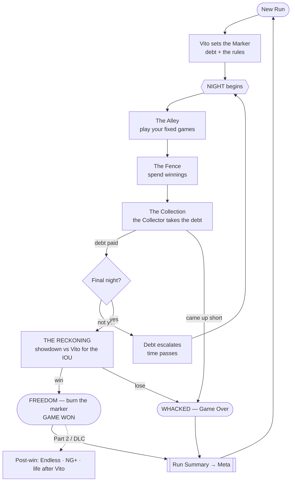
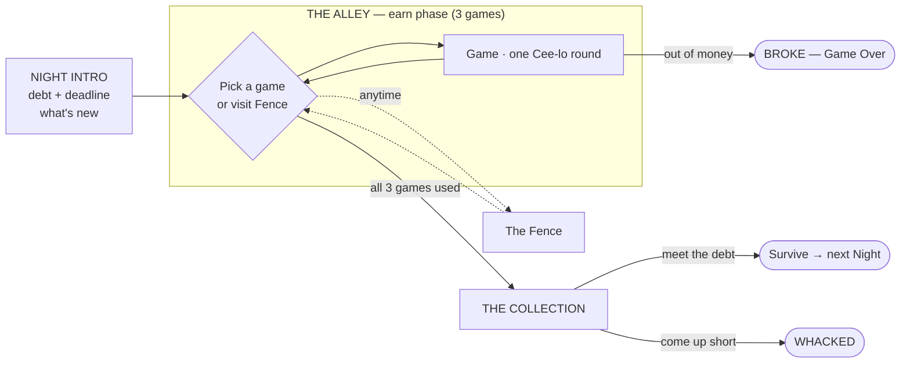
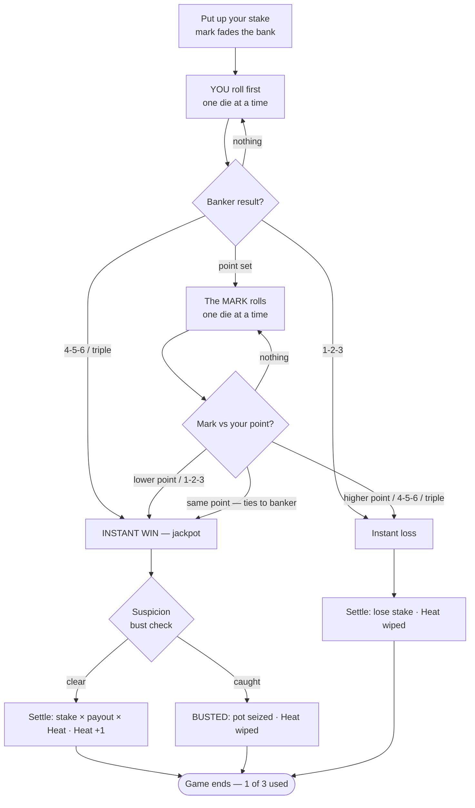
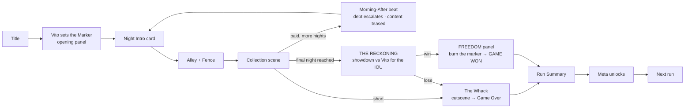
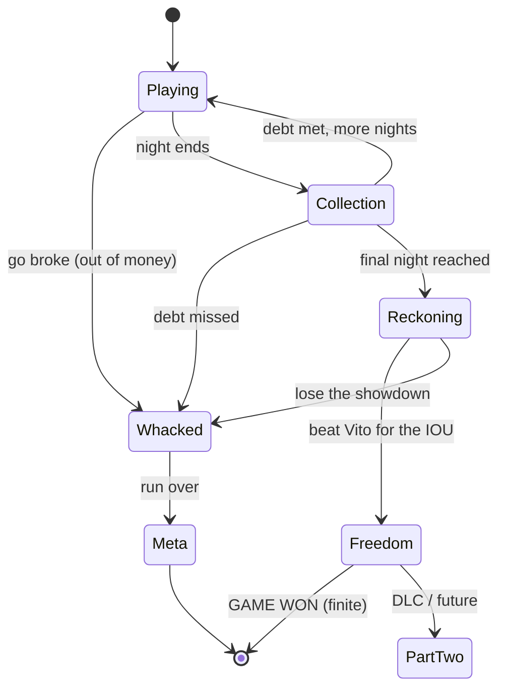

# BONES — Levels & Flow

How a run is structured, what a "level" is, and how the player moves between them. Companion to [`GAME_DESIGN_SPEC.md`](./GAME_DESIGN_SPEC.md); grounded in [`RESEARCH.md`](./RESEARCH.md).

---

## 1. Structural hierarchy — what a "level" is

There is no spatial "level select." The progression is **temporal**: you survive escalating **Nights**. A Night is our level.

```
RUN  ── one full attempt to win your marker back and escape Vito
 └─ ACT ── a band of nights with a difficulty theme (Act 1 = "The Marker")
     └─ NIGHT ── THE LEVEL. 3 games, a debt demand, a hard deadline
         └─ GAME ── one Cee-lo round: you bank a stake (instant win, or the mark counter-rolls)
             └─ THROW ── one pick-up → shake → reveal → score (your roll, a re-roll, or the mark's)
```

| Unit | What it is | Bounded by |
|---|---|---|
| **Run** | One attempt, start to the win (Freedom) or whacked | death or victory |
| **Act** | Difficulty band of nights | scripted milestones |
| **Night** | The level: earn → spend → pay or die | **3 games** + the Collection deadline |
| **Game** | One **Cee-lo round** — you are the banker, put up a stake, roll first | the round resolves (win / lose / push) |
| **Throw** | The core-loop heartbeat (a single roll within a game) | the dice settle |

**Key rule (your decision):** each Night gives **3 games** (Cee-lo rounds — see spec §5.1). Spend them earning. **If you can't pay the night's debt at the Collection → you get whacked. Game over.**

*Every game is played **on the street, on the ground** — a circle of players crouched over the pavement, dice bounced off a wall or curb. No tables anywhere (see spec §2 Staging).*

---

## 2. The run at a glance


*Post-win content (dotted) is reserved as DLC — the base game ends, finitely, when you burn the marker.*

Two nested arcs, exactly as the research prescribes:
- **Macro arc:** the rising debt across Nights — the walls closing in.
- **Micro arc:** the Heat streak and Suspicion gamble inside a single game in the circle.

---

## 3. Anatomy of a Night (the level)

Each Night runs three phases. The Alley is where the fixed-games limit bites.



- **Night Intro** — a comic panel: the Collector names tonight's number and the deadline; any newly available game/feature is introduced. Sets the target the player is playing toward.
- **The Alley (earn)** — a hub where you choose **how much to stake** across your **3 games this night** (each a Cee-lo round). How you spend those three throws — stake sizing and how crooked to play — is the core strategic decision of the level.
- **The Fence (spend)** — reachable from the hub (typically between/after games): buy dice, hone them, buy charms and limited-use favors. Stock is randomized (roguelike). You can **pay to re-roll the stock** — cheap the first time each night, pricier with every re-roll that night (resets next night). Hunt the build you want, or save the cash for the Collection (spec §8.2).
- **The Collection (deadline)** — the Collector arrives. Pay the demanded sum from bankroll (surplus stays as bankroll for next night's Fence). **Meet it → next Night. Miss it → whacked**, unless you burn a limited-use reprieve.

---

## 4. Anatomy of a Game (one Cee-lo round — you are the banker)

A game is one Cee-lo round. **You're always the banker:** you put up the stake, roll first, and can win outright — or set a point and let the mark try to beat it. Full rules in spec §5.1 / [`ceelo.md`](./ceelo.md).



- **Two paths, by design:** the banker roll either **wins instantly** (the jackpot) or **sets a point** and hands the mark a counter-roll (the tense back-and-forth). Either way it's *one* game.
- **Heat** builds across **consecutive winning games over the night** (not within a round); any loss or bust wipes it; it resets each night.
- **Suspicion** accrues across the **night's games** (the same marks watch you all night) and resets next night; **Lay Low** games and *Favors* keep it cold. The **bust check fires when you collect a win** with crooked dice.
- **No mid-game cash-out** — a game is a single round. The decisions are *how much to stake*, *how crooked to play*, and *when to burn a limited-use item*.

*There is **no safety net**. If your bankroll can't cover the minimum stake, you're **broke → game over → start again** (spec §8.1). Every dollar matters.*

---

## 5. The Act 1 level schedule

The campaign — Act 1, **"The Marker"** — runs Nights 1→7, ending in **The Reckoning**: a high-stakes **Cee-lo** game vs Vito for the IOU. **Win that and you've beaten the game** (finite win — spec §6.2). **Every night is Cee-lo** (the only game); what changes is the **debt**, the **systems** introduced, and **The Squeeze** — your base odds erode night to night (spec §6.4). The table is the **expected curriculum and pacing**. All numbers are **tuning placeholders.**

| Night | Debt due | Games | Opponent | What's new / what changes | Target time |
|---|---|---|---|---|---|
| **1** | $20 | 3 | The Nervous Rookie | Core loop · the reveal · Heat · the Collection & the whack · **you're favored** · **Fence unlocks after game 1 (first run only)** | 3–5 min |
| **2** | $55 | 3 | The Rookie | First loaded die · **Suspicion** · Lay Low | 5–7 min |
| **3** | $140 | 3 | The Regular | **Limited-use items** · the odds start to tighten (Squeeze) | 6–8 min |
| **4** | $375 | 3 | The Carnival Barker | Bigger stakes · charms matter · odds ~even | 7–10 min |
| **5** | $950 | 3 | The Old Gambler | Real pressure · deeper builds · **odds turn unfavored** | 8–12 min |
| **6** | $2,400 | 3 | The Dock Boss | Lean on cheats + Heat · brutal odds | 10–15 min |
| **7 — The Reckoning** | no tribute — the **IOU** is the prize | 3 | **VITO CARBONE** | **3 Cee-lo games vs Vito · win 2 of 3** · you bank · **Suspicion off** (both cheat openly) · Vito heavily loaded (~15%) · 3rd game hardest · **win = beat the game** (spec §6.5) | 8–12 min |

**Onboarding by discovery — no tutorial.** On a *constant* Cee-lo base, each early night quietly surfaces one new **system** (the Fence, Suspicion, limited-use items) — one thing at a time, learned by **playing**, never via pop-ups or rules screens. Difficulty then rises through the **debt** and **The Squeeze**, not through new games.

**The win is finite.** Beating Vito at The Reckoning ends the game — you take your marker, burn it, and you're out. A full victory run (the late nights run long) is what naturally stretches toward the hour-plus length, so the base campaign delivers the run-length curve on its own.

**Post-win = Part 2 (DLC / future, out of base scope):** life after Vito, **Endless / Deep Night** (debt escalating ~×2.5/night; score-chase), and **NG+ Acts** — all reserved as post-launch content, not part of the finite base game.

---

## 6. Unlocks & gating — how new content enters

With a **single game**, "new content" isn't new games — it's **new systems, new dice, and rising difficulty:**

1. **Scripted system intros (by discovery, no tutorial).** **Suspicion**, **limited-use items**, etc. surface on a fixed schedule — one thing at a time on a constant Cee-lo base, learned by playing rather than explained. The **Fence** is a one-time reveal: hidden for a brand-new player's very first game, it **unlocks after that first game and stays unlocked for every run after** (spec §8.2) — a small mystery-and-unlock hook.
2. **The Fence (player-driven variety).** New **dice, charms, and favors** enter through the randomized shop — your **build** is where run-to-run variety lives.
3. **Difficulty ramps (scripted).** The **debt schedule** climbs and **The Squeeze** (spec §6.4) erodes your base odds each night, bottoming at the **Vito finale (Night 7)**.

So: *what you owe and how hard it is* is scripted and rigid; *what you build* is player-driven through the Fence. The interplay is the run's strategic texture.

---

## 7. What carries between levels vs what resets

The flow depends on knowing exactly what persists across each boundary.

| State | Scope | Resets / ends when |
|---|---|---|
| **Bankroll** | whole run | new run (start at $0) |
| **Owned dice & cup loadout** | whole run | new run *(meta-unlocked dice become re-selectable)* |
| **Persistent items [P]** | whole run | new run *(unless meta-permanent)* |
| **Limited-use items [L]** | until charges spent | consumed, or run end |
| **Debt demand** | escalates each Night | — (only grows) |
| **The Squeeze (base odds)** | tightens each Night | resets next run (eases back to favored) |
| **Heat** | **the night** (across its 3 games) | any loss · bust · start of a new night |
| **Suspicion** | **the night** (builds across its 3 games) | start of a new night · decays when you play clean |
| **Meta unlocks / NG+ tier** | **permanent** | never |

**The persistent vs limited-use split (your decision) drives the between-level economy:** persistent items are your reliable backbone carried night to night; limited-use items are powerful, rationed, and the question every Collection night is *"is this the night I burn it?"* Limited-use power is also the player's scarce taste of real control — fitting the high-luck identity.

---

## 8. Player choices that shape the flow

Between and within levels, the meaningful decisions:

- **Survive the night:** with only **3 games** and **no safety net**, can you clear the debt without going broke? Every stake is a real risk to the run.
- **Stake sizing:** how much to put up each of the three games — bet big into a hot streak to clear the debt, or protect a thin bankroll. The central risk dial.
- **The Suspicion gamble:** how crooked to play, when to Lay Low, when to spend a Favor — knowing it builds all night across your 3 games.
- **Limited-use timing:** hoard clutch consumables, or spend now to make a tight Collection?
- **Fence priorities:** persistent backbone vs limited-use stockpile; hone existing dice vs buy new; and **whether to pay to re-roll the stock** (escalating cost per night) chasing a better build — or keep that cash for the Collection.
- **Route risk:** scrape past tonight's debt safely, or over-earn to bankroll a war chest for the brutal later nights? (Banking surplus is how you survive the escalation.)

---

## 9. Transitions between levels (the connective tissue)

The "flow between levels" is a sequence of short, styled comic beats — not menus. Each is a graphic-novel panel.



- **Vito sets the Marker** — one-time run intro: the debt, the threat, the deal.
- **Night Intro card** — tonight's number, the deadline, what's new. Quick, punchy.
- **The Alley hub** — between games you return here to choose the next game or hit the Fence.
- **The Collection scene** — the Collector arrives; tension beat as you pay (or can't). Meeting it = a relief panel; the surplus carries forward.
- **The Whack** — short, stylish game-over cutscene (the river, the trunk). Earns the loss.
- **Morning-After** — time-passes transition; the debt visibly escalates; next content teased — the "what's behind the next door" pull.
- **The Reckoning** — the final-night showdown vs Vito for the IOU. The campaign's climax.
- **Freedom** — the **ending**: you win the showdown, take your marker, burn it, and walk. Game beaten. *(Life-after-Vito is Part 2 / DLC.)*
- **Run Summary → Meta** — nights survived, biggest pot, deepest game reached → spend meta unlocks → next run.

---

## 10. Win & lose flow



- **Lose:** **go broke** (can't cover a stake), **miss a Collection**, or **lose The Reckoning** → game over → Run Summary → Meta. *Early runs end here fast (Nights 3–4) — that's intended: a quick, punchy ~15-min loss that sends you back smarter. Survival is what lengthens runs.*
- **Win (Freedom):** reach the final night and **beat Vito for the IOU** → burn the marker → **game beaten.** A finite, narrative win — not a score.
- **Part 2 (DLC / future):** life after Vito, Endless / Deep Night score-chase, NG+ — all post-win, out of base scope.

---

## 11. Pacing — the run-length curve

Your brief: *short & punchy early, scaling to 1 hr+ as the player improves (Cloverpit-style).* The structure delivers this without changing the rules:

- **Per-night pacing** is always punchy: 3–5 min early nights, up to ~15 min late.
- **Run length is emergent from skill, via the failure curve:**
  - **Novice:** whacked around Night 3–4 → **~15–25 min** runs. Fast, low-frustration, "one more run."
  - **Competent:** survive to The Reckoning (Night 7) → **~45–70 min** runs.
  - **Master:** a full clean victory run (long late nights + the showdown) sits at the **~1 hr+** top of the curve.
- Difficulty escalates faster than the player's early mastery, guaranteeing short early runs; rising skill + better builds push the wall back, organically lengthening runs toward the finite win — exactly the Cloverpit shape. *(Post-win Endless, a DLC mode, would extend beyond.)*

---

## 12. Open questions

1. **Games-per-night curve:** locked at **3** for now (your call). Open whether later acts ever step it up (4–5) — flat 3 keeps the escalating demand harder and runs swingier, which suits the high-luck identity.
2. **Stake limits:** is there a min/max stake per game, and does the max scale with bankroll or the night's demand? (Stake sizing is the central risk dial, so its bounds matter.)
3. **Fence availability:** between every game, or only once per night (a single shopping beat)? (Leaning: anytime from the hub, but stock refreshes once per night.)
4. **Surplus carry:** does *all* leftover bankroll carry to the next night, or does Vito's interest skim a cut? (Skimming surplus would tighten the economy and discourage hoarding.)
5. **Whack saves:** how many limited-use reprieves can exist at once, and do they fully cover a missed Collection or only partially?
6. **Boss cadence:** is Vito only the Act finale (Night 7), or do mid-act "lieutenant" mini-bosses (the Dock Boss, etc.) get their own special rules?
